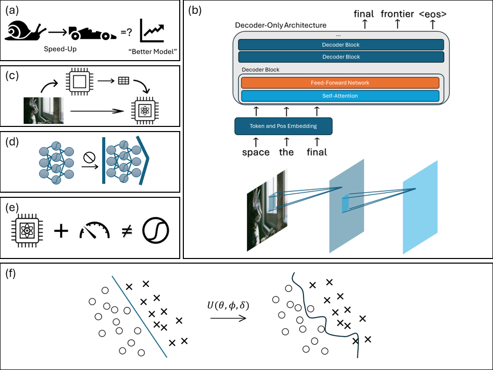

# Quantum Hamiltonian Embedding of Images for Data Reuploading Classifiers

This repo contains the code and numerical experiment results for the paper 
[***Quantum Hamiltonian Embedding of Images for Data  Reuploading Classifiers***]() by *Peiyong Wang, Casey R. Myers, Lloyd C. L. Hollenberg and Udaya Parampalli*. 

How to design a quantum machine learning model is the first question we need to answer when trying to apply quantum computing to machine learning tasks. In this paepr, we first lay out six principles for designing quantum machine learning algorithms, based on observations and evidence from the design of classical deep learning algorithms, centering on the heuristics from model structures and properties of the data. We investigate the effectiveness of these simple principles by designing a data re-uploading classifier, where the classical data is encoded as the evolution of quantum Hamiltonians. Such a classifier designed following the principles proposed in this paper has better performance compared to the baseline quantum convolutional neural network model with numerical experiments on common machine learning datasets such as the MNIST and FashionMNIST dataset. 

Fig. 1: Six aspects to be kept in mind when designing quantum machine learning models. Box (a): Speedup is not the first thing to consider when designing new quantum machine learning models, since it does not necessarily lead to "better models", i.e. improvements in metrics of performance, such as accuracy. Box (b): The intrinsic structure of the data should be taken into account when designing the model architecture. Images have two major spatial directions, so the convolution kernel in a CNN will scan in both directions, while text data only has a single temporal dimension, so the model needs to generate the words one by one. Box (c): Using a classical model, such a neural network backbone or PCA to reduce the dimension of the data (the upper path), obscures the real effectiveness of the quantum machine learning model, so we should minimise classical preprocess as much as possible. Box (d): Avoid direct ``quantisation", i.e. avoid using quantum circuits to implement the exact mathematical operations of a classical machine learning model. Box (e): Measurements in the quantum circuit of the quantum machine learning model may not have the same kind of nonlinearity as the activation functions in classical neural networks, such as the ReLU (rectified linear unit, $\operatorname{ReLU}(x) = \operatorname{max}(0, x)$) function. Box (f): Some data embedding methods, such as angle embedding, may introduce unwanted bias toward certain kinds of decision boundaries, harming the performance of the machine learning model.